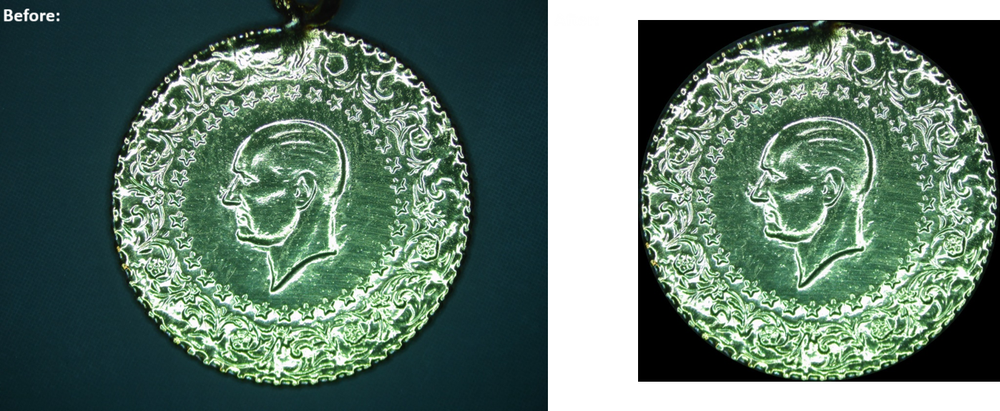
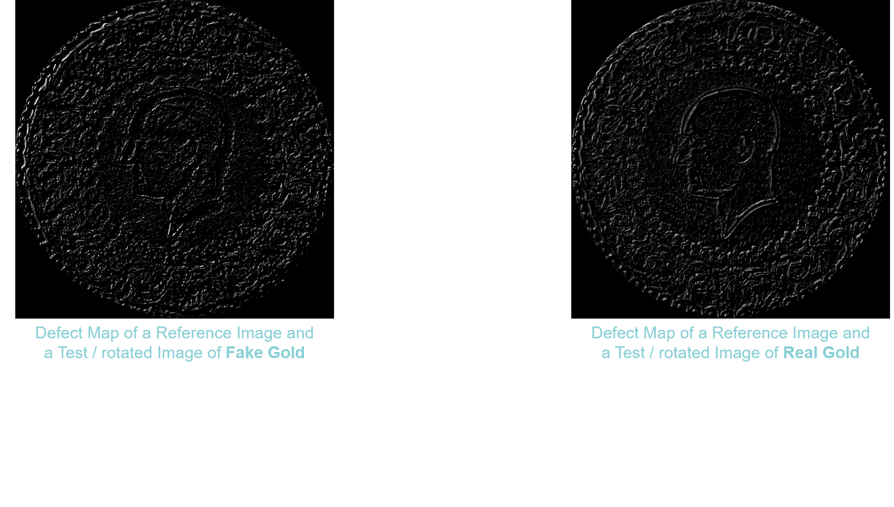

# Counterfeit Turkish Gold Coin Detection (Altın) 

This repository documents the implementation of the paper "Statistical edge-based feature selection for counterfeit coin detection", adapted specifically for authenticating Turkish gold coins (locally called "altın"). The project focuses on detecting counterfeit çeyrek altın (¼-size coins) through advanced image processing and statistical edge feature analysis.

Turkish "çeyrek altın" coins - identical design across sizes but varying diameters (14mm-22mm). This project focuses on the 18mm çeyrek altın.

## 📌 Project Overview
Counterfeit coins are a growing concern, with a reported 12.03% increase in detected counterfeit coins between 2017-2018. Traditional detection methods (weight, sound, chemical tests) are no longer reliable due to sophisticated forgery techniques. This method leverages **edge-based features** (width, thickness, orientation) to distinguish genuine coins from counterfeit ones. The original paper achieved **99.4% accuracy** on the Danish Coin Dataset, while this prototype uses a custom-collected dataset.

**Key Insight**:  
*"It has been experimentally established by other related works [9, 16, 21] that the edges of counterfeit coin stamp are the prime indicator to distinguish between genuine and counterfeit coins, since even the high-quality forged coins have wider, taller, detached or missing strokes."*  
*(This line is directly quoted from the paper [1].)*

## 🎯 Problem Statement
- Counterfeit coins exhibit subtle edge defects (wider, taller, detached, or missing strokes) invisible to traditional methods.
- Manual inspection is time-consuming and requires expertise.
- **Goal**: Automate counterfeit detection using statistical edge analysis and machine learning.

## 🛠 Methodology
The pipeline involves 8 key steps:
1. **Gold Segmentation/Cropping**  
   - Use **HSV thresholding** along side other opencv methods to isolate the coin from the background.
   - Output: Cropped circular coin image (e.g., 905x905 pixels).
   
   

2. **Choosing Reference Coins**  
   - Select multiple reference coins (genuine and worn) to account for natural variations in wear and contamination, in our custom database one coin was set as the referance

3. **Rotation Alignment**  
   - Adapted the paper’s method: Rotated the test coin incrementally (1° steps across 360°) and calculated Euclidean distance between the reference and test coin’s edge maps at each angle.
   - The rotation angle with the minimum Euclidean distance (identified from the 360-value vector) was applied to align the test coin with the reference.
   - Result: Perfect edge overlap between reference and aligned test coin (critical for accurate defect detection).
     
4. **Defect Map Extraction**  
   - Apply **Sobel edge detection** on reference and rotated test images.
   - Generate a defect map via **pixel-wise difference** to highlight discrepancies.
   
   

5. **ROI Extraction**  
   - Crop regions of interest (ROI) from defect maps to reduce computational load.

6. **Feature Extraction**  
   - Extract edge metrics:  
     - Horizontal/vertical edge counts (`Nεh`, `Nεv`).  
     - Edge lengths, positions, directions (horizontal, ±45° diagonals).  
     - Similarity metrics (SSIM, MSE, SNR).  
   - Two feature dataframes:  
     - **Dataframe A**: 52,584 rows × 14 columns.  
     - **Dataframe B**: Reduced to 26,292 rows × 15 columns.  

7. **Dimensionality Reduction**  
   - Apply **PCA** with Min-Max scaling, retaining 97% variance with 6 components.

8. **Classification**  
   - Train/test classifiers on the reduced feature set (specific classifiers not listed in the presentation).

## 📂 Dataset
- **Original Paper Dataset**: Danish Coin Dataset (4 subsets, 2,264 images each).  
  - High-resolution grayscale images (3500x3500 pixels) scanned via 2D scanner.  
- **Prototype Dataset**:  
  - **Custom-collected dataset** (due to unavailability of the Danish Dataset).  
  - Captured using a digital microscope.  
  - Split into:  
    - **Reference** (1 image),  
    - **Real** (2 images),  
    - **Fake** (4 images).  

## 📊 Results
- The original paper achieved **99.4% accuracy** on the Danish Coin Dataset.  
- Prototype testing on the custom dataset showed clear distinction between real and fake defect maps:  
  - **Real coins**: Organized, consistent edges.  
  - **Counterfeit coins**: Chaotic, irregular edges.  

## 🏁 Conclusion
This method effectively identifies counterfeit coins by analyzing edge defects, outperforming traditional techniques. While the original paper validated results on the Danish Dataset, this prototype demonstrates feasibility using a smaller custom dataset. Future work includes expanding the custom dataset and testing additional classifiers for robustness.

## 🔗 References
- Paper: *"Statistical edge-based feature selection for counterfeit coin detection"*.  

---

*Note: Code implementation is not yet available. This repository serves as a documentation hub for the methodology. Contributions or inquiries are welcome!*
